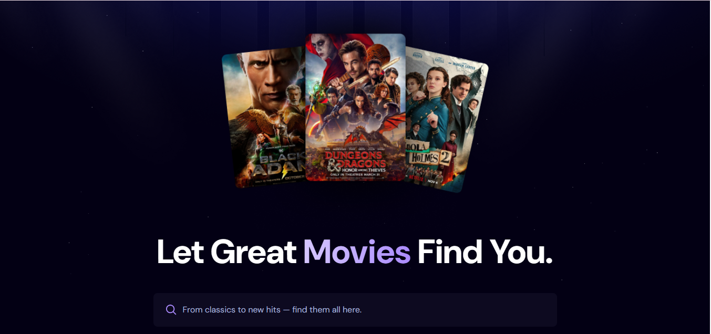
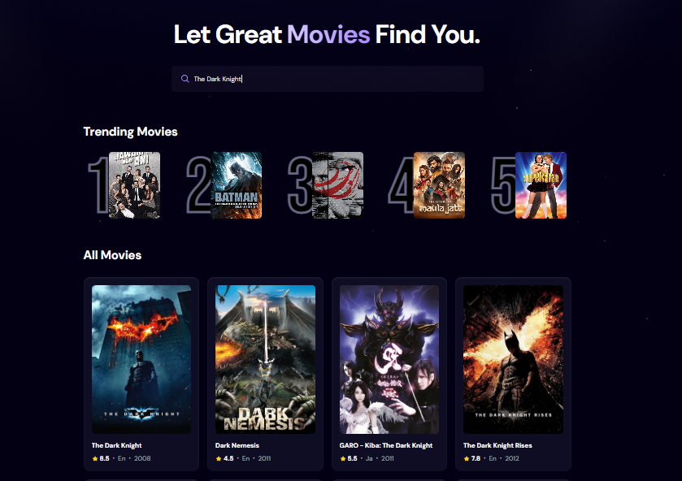
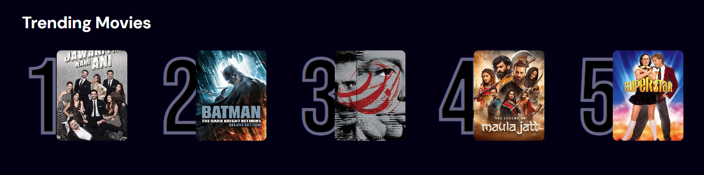
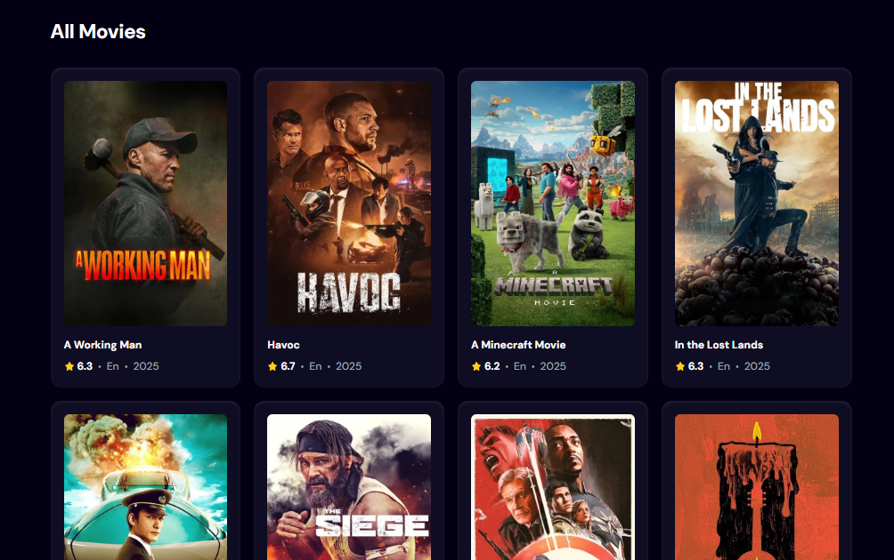

# CineFlex: Let Great Movies Find You



CineFlex is a modern movie discovery application that helps you find your next favorite film. With a sleek interface and powerful search capabilities, CineFlex makes it easy to explore the world of cinema and discover trending movies.

## Problem Statement

Movie enthusiasts often struggle with:

- Finding new movies that match their interests
- Keeping track of trending films
- Discovering hidden gems in the vast world of cinema
- Getting personalized movie recommendations

CineFlex addresses these challenges by providing a user-friendly platform that combines trending movie data with powerful search functionality, making movie discovery effortless and enjoyable.

## Features

### Intuitive Search Experience


- **Smart Search**: Find movies instantly with our responsive search bar
- **Debounced Input**: Optimized search that prevents excessive API calls
- **Real-time Results**: See search results as you type

### Trending Movies Section


- **Popular Films**: Discover what's hot right now in the movie world
- **Visual Rankings**: See top movies with their ranking numbers
- **Quick Access**: Easily identify and explore trending content

### Comprehensive Movie Grid


- **Visual Cards**: Browse movies with beautiful poster images
- **Key Information**: See ratings, release years, and languages at a glance
- **Responsive Layout**: Enjoy a seamless experience on any device

### Additional Features

- **Movie Details**: View comprehensive information about each film
- **Rating System**: See audience ratings with star icons
- **Language Indicators**: Identify movies in your preferred language
- **Release Year Display**: Quickly find movies from specific years
- **Fallback Images**: Graceful handling of missing movie posters

## Tech Stack

- **Frontend**: React.js with Vite
- **Styling**: Tailwind CSS
- **State Management**: React Hooks (useState, useEffect)
- **API Integration**: TMDB (The Movie Database) API
- **Backend Services**: Appwrite for data persistence
- **Performance Optimization**: React-use for debouncing
- **Development Tools**: ESLint, Vite

## Getting Started

### Prerequisites

- Node.js (v14 or later)
- npm or yarn
- TMDB API key
- Appwrite account and credentials

### Installation

1. Clone the repository:
   ```bash
   git clone https://github.com/yourusername/cineflex.git
   cd cineflex
   ```

2. Install dependencies:
   ```bash
   npm install
   # or
   yarn
   ```

3. Create a `.env` file in the project root with your API credentials:
   ```
   VITE_TMDB_API_KEY=your_tmdb_api_key
   VITE_APPWRITE_PROJECT_ID=your_appwrite_project_id
   VITE_APPWRITE_DATABASE_ID=your_appwrite_database_id
   VITE_APPWRITE_COLLECTION_ID=your_appwrite_collection_id
   ```

4. Start the development server:
   ```bash
   npm run dev
   # or
   yarn dev
   ```

5. Open your browser and navigate to `http://localhost:5173`

## API Setup Guide

### TMDB API

1. Visit [TMDB](https://www.themoviedb.org/)
2. Create an account if you don't have one
3. Navigate to your account settings and request an API key
4. Add your API key to the `.env` file as `VITE_TMDB_API_KEY`

### Appwrite Setup

1. Create an account on [Appwrite](https://appwrite.io/)
2. Create a new project
3. Set up a database and collection for storing trending movies
4. Add your Appwrite credentials to the `.env` file

## Usage Guide

1. **Search for Movies**:
   - Type in the search bar to find specific movies
   - Results will appear in real-time as you type

2. **Explore Trending Movies**:
   - Check the trending section to see popular films
   - Click on any movie to view more details

3. **Browse All Movies**:
   - Scroll through the movie grid to discover new films
   - Each card displays key information about the movie

## Project Structure

```
cineflex/
├── public/              # Static assets
├── src/
│   ├── components/      # Reusable UI components
│   ├── appwrite.js      # Appwrite service integration
│   ├── App.jsx          # Main application component
│   └── main.jsx         # Application entry point
├── .env                 # Environment variables (not in repo)
├── index.html           # HTML template
├── package.json         # Project dependencies
└── vite.config.js       # Vite configuration
```

## Current Limitations

- **API Rate Limits**: TMDB API has rate limits that may affect heavy usage
- **Search Accuracy**: Search results depend on the quality of the search term
- **Image Loading**: Some movies may have missing poster images
- **Offline Mode**: The application requires an internet connection
- **Limited Filtering**: Currently no advanced filtering options

## Future Improvements

- **User Accounts**: Allow users to create accounts and save favorite movies
- **Advanced Filters**: Add filtering by genre, year, rating, etc.
- **Movie Details Page**: Create detailed pages for each movie
- **Recommendations**: Implement personalized movie recommendations
- **Watchlist**: Allow users to create and manage watchlists
- **Reviews & Ratings**: Enable user reviews and ratings
- **Mobile App**: Develop dedicated mobile applications
- **Offline Support**: Implement service workers for offline functionality
- **Internationalization**: Add support for multiple languages
- **Dark/Light Mode**: Add theme switching capability

## Troubleshooting

- **Search Not Working**: Check your TMDB API key and internet connection
- **Images Not Loading**: Some movies may not have poster images available
- **Appwrite Errors**: Verify your Appwrite credentials and database setup
- **Performance Issues**: The application may slow down with many API requests

## About the Developer

This project was developed by Muhammad Huzaifa Saqib (zaiffi), a developer passionate about creating practical solutions for entertainment and media discovery. With a focus on building user-friendly applications that enhance how people interact with digital content.

- **GitHub**: [zaiffishiekh01](https://github.com/zaiffishiekh01)
- **LinkedIn**: [Muhammad Huzaifa Saqib](https://www.linkedin.com/in/muhammad-huzaifa-saqib-90a1a9324/)
- **Email**: [huzaifasaqib420@gmail.com](mailto:huzaifasaqib420@gmail.com)

## License

This project is licensed under the Apache License 2.0 - see the LICENSE file for details.

---

**CineFlex** - Let Great Movies Find You
